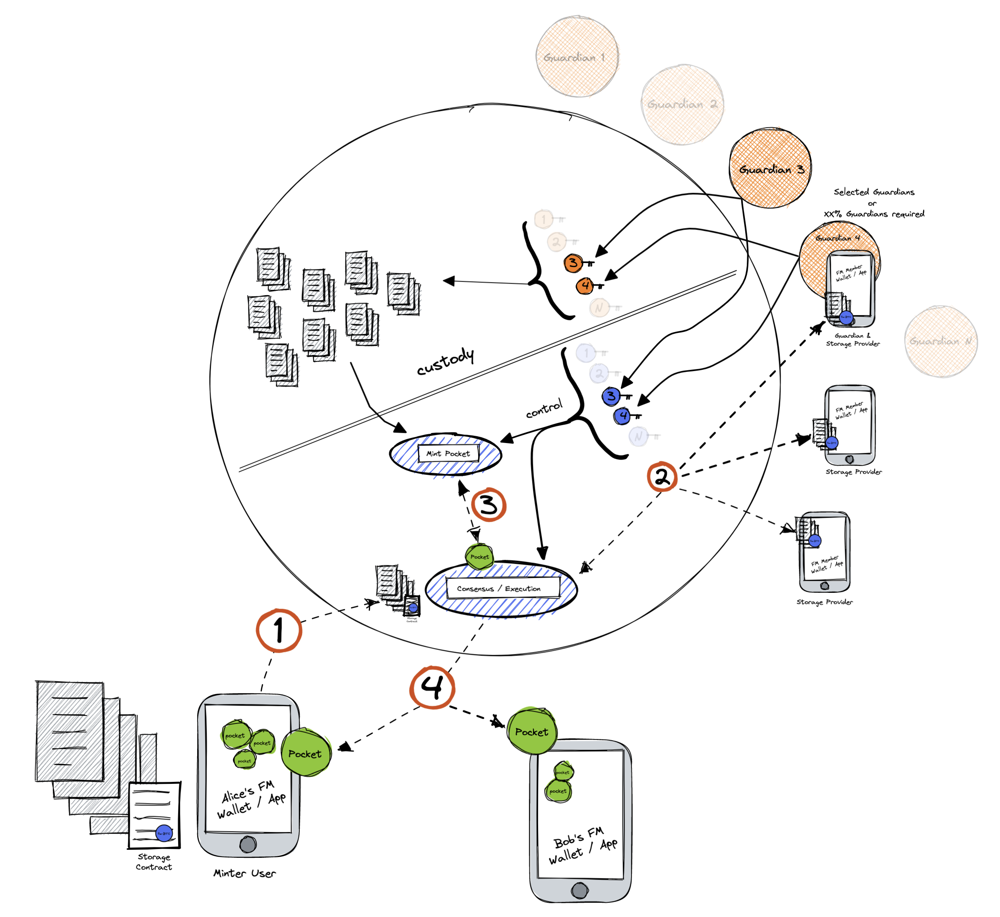
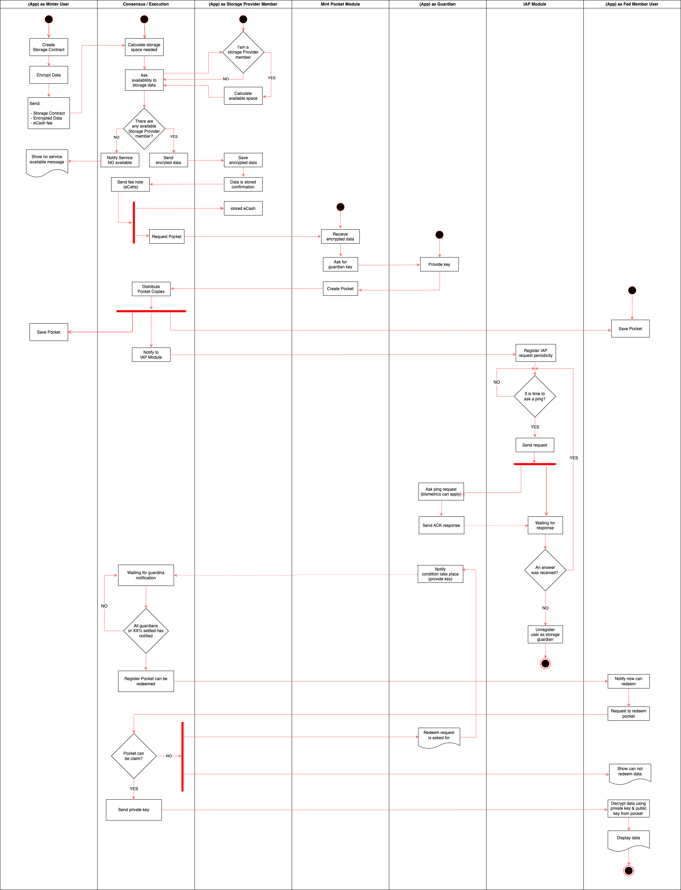

# Internal Storage Schema

#### Step 1: Minter user request Storage Service

Alice requests a Storage Data Service to Fedimint by sending a Storage Contract and an e-cash fee as a reward for the storage service.
Storage Contract can specify:

1. Who will receive a note called pocket to redeem stored data (must be a Fedimint user).
2. Choose the type of storage schema (Internal Storage Provider Schema).
3. Select Guardians assigned to monitoring some event.
4. Mention how many percent of Guardians are necessary to allow users to redeem data with their pockets.
5. Indicate how often Guardians should respond to an "I'm alive ping" or if they don't need to respond.

#### Step 2: Broadcast to Internal Storage Providers

The Storage Providers are incentivized to store the data in exchange for the fee established in the first step. The data will be stored in each one of the member’s phones.

#### Step 3: Fedimint Pocket

Notes called [“Pockets”](./02-what-is-a-pocket.md), that have the same mechanism as e-cashes, are created by the “Mint Pocket Module”. These "Pockets" have a hash that represents the data that users will claim in the future.

#### Step 4: User receive Pockets

Users that were specified in the step one of the Storage Contract now have a “Pocket” in their "My FM Wallet".

#### Step 5: I’m Alive Ping request

According to the step one of the Storage Contract an IAP ([“I’m Alive Ping”](./03-i-am-alive-ping.md)) request would be sent to Guardians as a mechanism to know if each one of them are online or not; furthermore, according to these responses, actions can be taken, like remove temporarily/definitely the Guardian from the role or skip its corresponding key, among others.

#### Step 6: Claim information

When conditions take place Guardians provide their keys in order that every user that has a pocket can redeem it. It’s important to say that it is necessary to have the % of Guardians specified as needed in the Storage Contract. \*Conditions are events monitored by Guardians

## Activity Diagram

###### Continue with [Pockets](./02-what-is-a-pocket.md)

###### Got to [Menu](../README.md)
