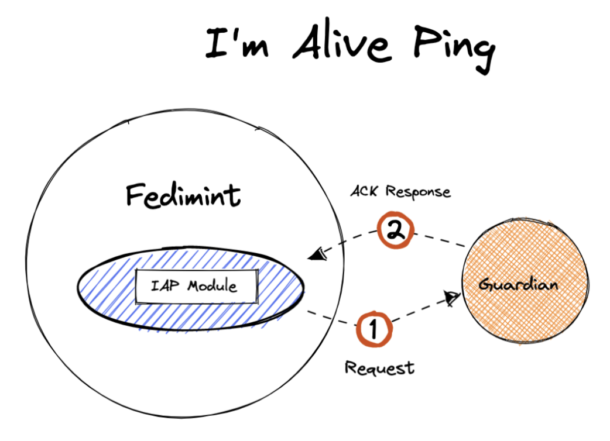

# What is an “I’m alive ping”?

It is a request (ping) made by the IAP Fedimint Module to every Guardian designed by the Federation. In turn, each Guardian must respond to this ping so that the Federation knows everyone is alive and online. (biometrics can apply).

###### Continue with [External Storage Provider Schema](./04-external-storage-schema.md)

###### Got to [Menu](../README.md)
