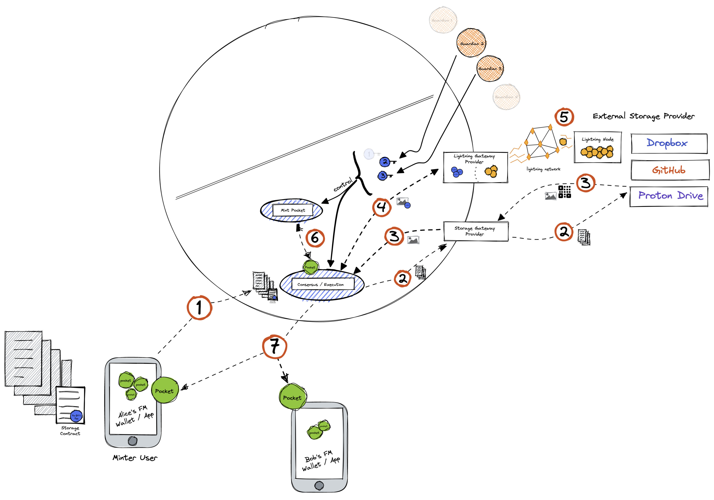
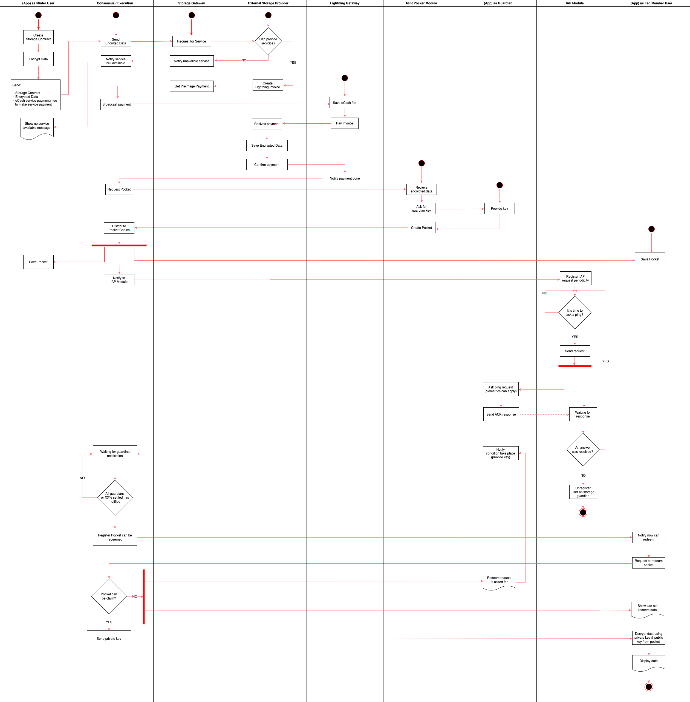

# External Storage Schema

#### Step 1: Minter user request Storage Service

Alice requests a Storage Data Service to Fedimint by sending a Storage Contract and an e-cash as payment for the external storage service and another e-cash as fee to incentive the payment through Lightning Network.

Storage Contract can specify:

1. Who will receive a note called pocket to redeem stored data (must be a Fedimint user).
2. Choose the type of storage schema (External Storage Provider Schema).
3. Select Guardians assigned to monitoring some event.
4. Mention how many percent of Guardians it is necessary to allow users to redeem data with their pockets.
5. Indicate how often Guardians must respond to a “I’m alive ping” or if they don’t need to respond.

#### Step 2: Request Service to External Storage Providers through a Storage Gateway

Data is sent to the External Storage Provider through a Storage Gateway Provider in order to make that request anonymous.

#### Step 3: The Lightning invoice

The External Storage Provider, as a lightning merchant, generates a lightning invoice and its preimage is sent to the Federation.

#### Step 4: Broadcast to Lightning Gateway

Alice’s fee is used to encourage a Lightning Gateway Provider to pay through the Lightning Network the external storage service.

#### Step 5: Lightning Gateway Pays Invoice

The Lightning Gateway Provider routes a payment through the Lightning Network in order to pay the External Storage Provider's preimage.

#### Step 6: Fedimint Pocket

Notes called [“Pockets”](./02-what-is-a-pocket.md), that have the same mechanism as e-cashes, are created by the “Mint Pocket Module”. These "Pockets" have a hash that represents the data that users will claim in the future.

#### Step 7: User receive Pockets

Users that were specified in the step one of the Storage Contract now have a “Pocket” in their "My FM Wallet".

#### Step 8: I’m Alive Ping Request

According to the step one of the Storage Contract an IAP ([“I’m Alive Ping”](./03-i-am-alive-ping.md)) request would be sent to Guardians as a mechanism to know if each one of them are online or not; furthermore, according to these responses, actions can be taken like remove temporarily/definitely the Guardian from the role or skip its corresponding key, among others.

#### Step 9: Claim information

When conditions take place Guardians provide their keys in order that every user that has a pocket can redeem it. It’s important to say that it is necessary to have the % of Guardians specified as needed in the Storage Contract. \*Conditions are events monitored by Guardians

## Activity Diagram

###### Continue with [Will Use Case](./05-will-use-case.md)

###### Got to [Menu](../README.md)
