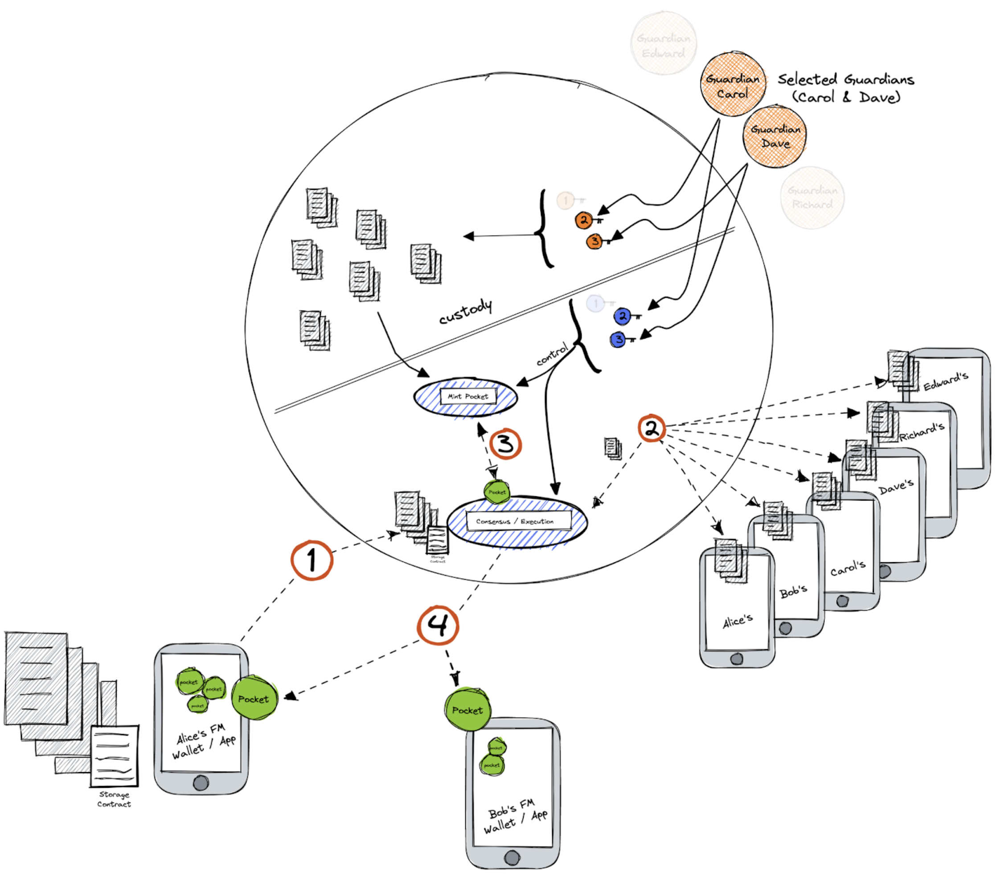

# Will

https://user-images.githubusercontent.com/29168985/215959774-bf87f45b-ac2c-4a04-8925-00a2d910f5a4.mp4

**Objective/Context:** Alice wants her will to be delivered to her son Bob when she dies. She also knows that the country's government she lives in will take a huge percentage of that as a government's fee, maybe 30% or 40%. So Alice needs another option... the Federation.

**Federation Composition** - Family Members

- Alice & Bob are members of the Federation but they are not Guardians and they have no servers running inside the Federation.
- Carol & Dave (Alice’s siblings) are Guardians.
- Edward & Richard are Alice's cousins and members of the Federation, they have no Guardian roles in this use case but they will lend their phones to storage encrypted data.

##### Solution

Alice mints her will into the Federation using an Internal Storage Provider Schema with a contract that specifies:

- Bob will be allowed to redeem the pocket and claim the will after and only after Alice dies.
- Copies of the will must be stored in an Internal Storage Provider Schema.
- Guardians (Carol & Dave) are the only ones who can act upon Alice's death.
- If one of the Guardians does not respond to the IAP 3 consecutive times this Guardian will be removed from his Guardian role.

Now, Alice’s will is guarded by the Federation, in this case, it will be stored 6 times in an encrypted form in each member’s device and there is no way to unencrypt it without Guardians keys.

Then, two [pockets](./02-what-is-a-pocket.md) are created, one of them is delivered to Alice and the other to Bob.

When Alice dies, Bob claims the will by passing his pocket note to the Federation. Carol & Dave as Guardians provide the keys to allow Bob to obtain the document.

##### App Wireframe

###### Continue with [Evidence Disclosure Use Case](./05-2-evidence-disclosure-use-case.md)

###### Got to [Menu](../README.md)
