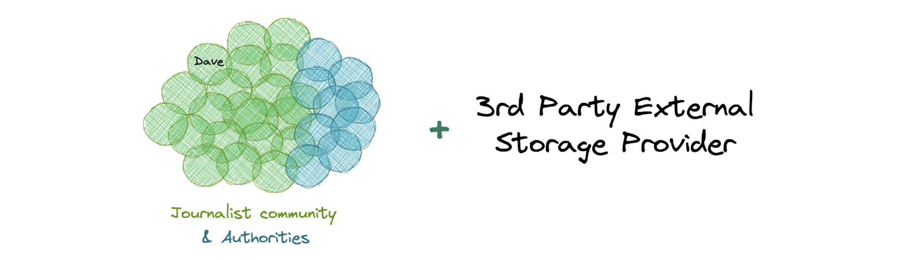
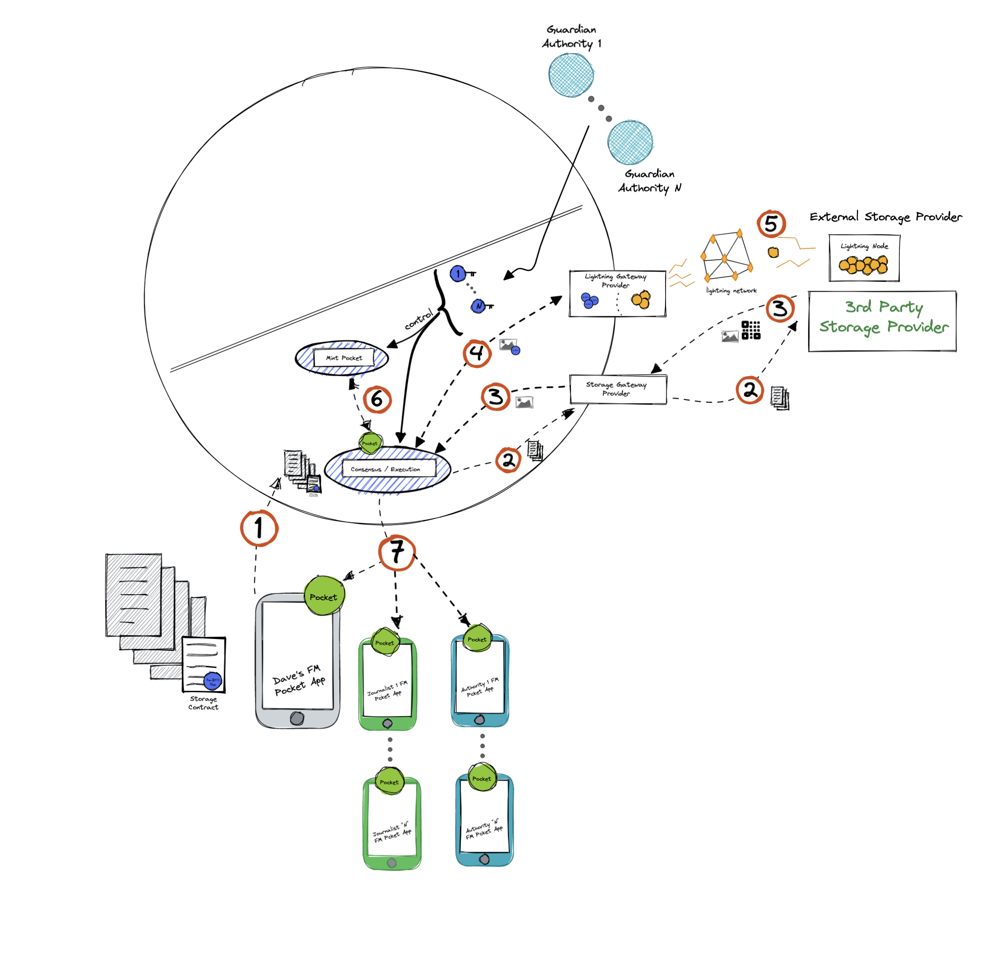

# Evidence disclosure

**Objective/Context:** Dave is a journalist who has been gathering legal evidence against a criminal group. He is creating a file with all this evidence in order to, at some point, present them in court. If during this time someone attempts against his life all this evidence must be delivered to a journalist community. Due to the nature of the data Dave needs to store the evidence anonymously inside a professional storage data service.

**Federation Composition** - Community Members + External Storage Provider

- Dave and his journalist colleagues are members of the Federation, they don't possess servers running inside Fedimint.
- Legal authorities are members of the Fedimint and also some of them are Guardians and have lighting nodes, Lightning Gateway providers and Storage Gateway providers inside the Federation.

NOTE: A 3rd party storage provider figures out the schema but is not a member of the Federation.

##### Solution

Dave mints his evidence data into the Federation using an External Storage Provider, paying the external service fee and adding a contract that specifies:

- All journalists will be allowed to redeem the pocket in order to claim the evidence if and only if Dave’s life is put at risk.
- A copy of the evidence must be stored in an encrypted form in a professional data storage service.
- Guardians (some anonymous authorities) are the only ones who can act upon any attempt against Dave’s life.

Once the process of external storage provider flow is complete, Dave’s evidence is guarded by the 3rd party storage service, which has no knowledge of the data and the origin of it because data was delivered form a Storage Gateway Provider.

Then, pockets are created and delivered to each one of the Fedimint members, journalists and authorities.

When authorities confirm an attempt against Dave, the Guardians, in this case some anonymous authorities members, can provide their keys in order that the journalist community and the rest of the authorities be allowed to redeem the document with their pockets.

###### Continue with [Avoid Corruption Use Case](./05-3-avoid-corruption-use-case.md)

###### Got to [Menu](../README.md)
