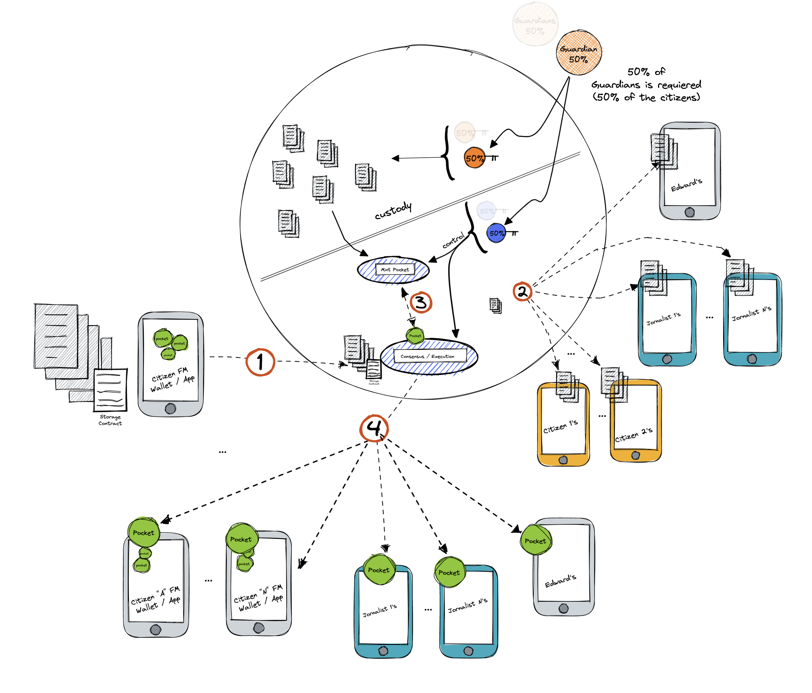

# Avoid Corruption

**Objective/Context:** Edward, a well-known journalist, knows about some Government 's and a Bottled Water Company's corruption acts. One day, he received a letter from a small community that had been suffering from various health problems, including stomach diseases, for several months. The residents believe that a Bottled Water Company has been executing bad practices over the springs of the area.

Residents have compiled all types of evidence, but they don't want to publish it in a personal way because of retaliation. So, they asked for Edwards's help.

Edward wants to protect residents and share the data to a community of journalists if those acts go on.

**Federation Composition** - Community Members

- Edward and the Journalist Community are members of the Federation, but they don’t have servers running inside the Federation.
- Residents are the Guardians and they don’t have servers running inside the Federation.

##### Solution

Edward asks residents to mint all the evidence that they possess in order to use the Internal Server Provider Schema with a contract that specifies:

- All members of the Federation will be allowed to claim data if corruption acts go on or if one of the Guardians doesn’t respond to the “I’m alive ping” (IAP).
- The “I’m alive ping” must be sent to the Guardians every day.
- Data must be encrypted and stored in a distributed way in each one of the member’s phones.
- Guardians (residents) are the only ones allowed to confirm that the acts take place.
- Only 50% of the Guardians is necessary to confirm acts.

Once the process of internal storage provider flow is complete, evidence is guarded by all the members of the Federation.

Then, pockets are created and delivered to each one of the Fedimint members: Edward, the Journalists Community and Residents.

When Residents confirm, they as Guardians provide their keys in order that Edward, the journalist community and all the citizens be allowed to redeem data with their pockets.

NOTE: During this time the custodians will be receiving a request to respond to an “I’m live ping” every day.

###### Continue with [Social Custody Platform](./05-4-social-custody-platform.md)

###### Got to [Menu](../README.md)
