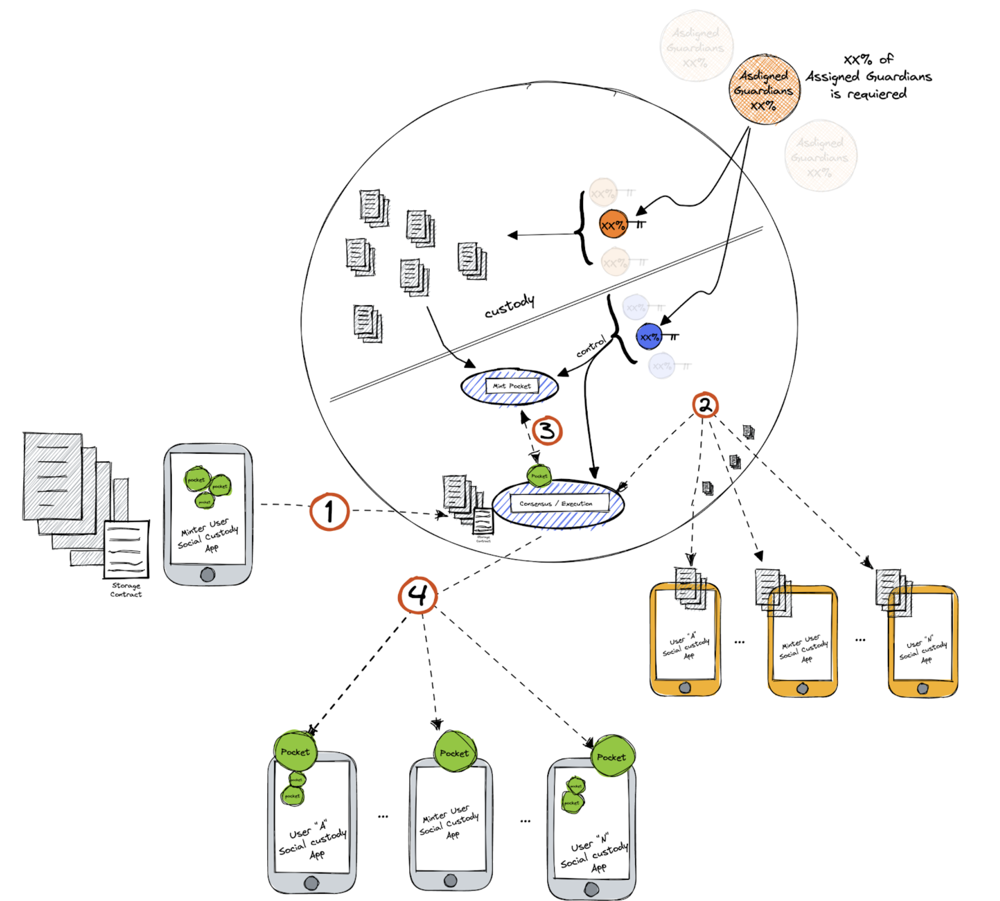

# Social Custody Platform

**Objective/Context:** Create a social media platform that allows everyone to mint important data that roles as evidence of illegal acts in an anonymous and distributed way to release them when some specified conditions take place.

**Federation Composition** - Community of social media platform users.

- Every user of the platform has a phone with the Fedimint social platform app and is a member of the social custody Federation.

##### Solution

Every user mints data into the Federation using the Internal Server Provider Schema with a contract that specifies:

- All users of the Federation will be allowed to redeem pockets when Guardians provide keys of some stored data.
- All the assigned Guardians must respond to the “I’m alive ping” every time the ping is requested otherwise the user stops having a Guardian role.
- All data must be encrypted and must be distributed to every user phone.
- Custodians are assigned randomly and are the only ones allowed to confirm trigger events.
- Percentage of Guardians required to release data (became redeemable for all users).

Once the process of internal storage provider flow is complete, triggered by a user data minted, the data evidence is guarded by all the members of the Federation (platform users) in their phones.

Then, pockets are created and delivered to each one of the Fedimint members (platform users).

A bunch of users are randomly designated to be Guardians specifically to that particular data. These users now have the duty to monitor and confirm events stipulated by the data minter user; these events could be someone’s death, an illegal act, an attempt to kill someone, etc.

Every now and then, Guardians will receive an IAP request that must always be responded to, otherwise the Guardian will lose his Guardian role.

When a percentage, specified by the minted user, confirms an event, keys will be provided, so all the platform users are now allowed to redeem data with their pockets.

###### Continue with [Voting System and Bidding Process](./05-5-voting-system-and-bidding-process.md)

###### Got to [Menu](../README.md)
