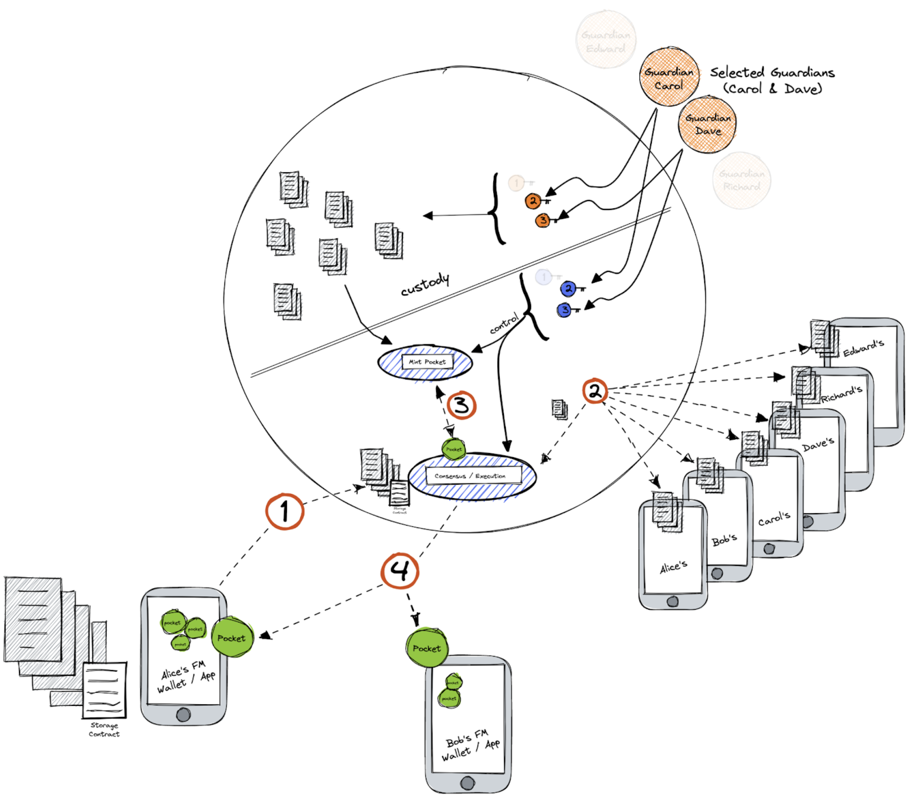

# Voting System and Bidding Process

**Objective/Context:** In community Z, the allocation of resources will be carried out for the project whose rating shows that it is the most critical. This, according to the evaluations of the members of the same community. For this, a voting system is needed through which each member of the community can cast their vote in a secure, anonymous and non-traceable manner.

In order to start the management of the project, a bidding process is needed. Through this process the community will be able to subcontract different service providers according to the needs of the project.

This leads to two use cases.

### a) Voting System

**Federation Composition** - Community Members + Internal Storage Provider

- Sandro, Daniel and Alex are members of the Federation and play the role of Guardians. They also will lend their phones to storage the voting system data in an encrypted form.

##### Solution

Each member of the community will mint their vote into the Federation using an Internal Storage Provider with a contract that specifies:

- Members of community Z will mint their vote through their "My FM Wallet".
- Every vote must be stored in an encrypted form using an Internal Storage Provider Schema.
- When results are ready and the % of Guardian's keys required is complete each member of the community Z will be able to see them by redeeming their pocket.

### b) Bidding Process

**Federation Composition** - Community Members + External Storage Provider

- A, B and C are companies using Fedimint. These 3 companies will participate in a bidding process during which they will have to mint all the documentation required by who's carrying out the bidding.

NOTE: A 3rd party storage provider figures out the schema but is not a member of the Federation.

##### Solution

Each company will mint all documentation required by the bidding process using an External Storage Provider, paying the external service fee and adding a contract that specifies:

- All documentation must be stored in an encrypted form using an External Storage Provider.
- When the process is done, results ready and the % of Guardian's keys required is complete, every stakeholder in the bidding process will be able to see them by redeeming their pocket.

###### Continue with [Social Status/Trust Bureau](./05-6-social-status-trust-bureau.md)

###### Got to [Menu](../README.md)
